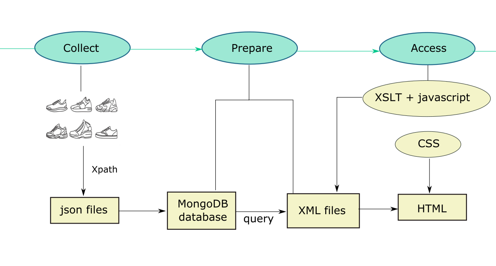

# An Adidas Database
- A customary data processing pipeline is generally composed of three fundamental phases: **collect**, **prepare**, and **access**.
- The objective of the project outlined in this repo is to build an Adidas shoe database. The intention further involves querying this database and subsequently presenting interesting statistical insights derived from it on a website.
## Workflow


- Collect: scrape shoe product information from adidas.de and save in json files
- Prepare: set up a MongoDB database and insert json files into that database
- Access: query the database to do statistical analysis, write the results in one XML file, write XSLT templates to transform XML to HTML, finally achieving the goal of presenting the the database’s statistics on a website
## File Structure
```bash
├── README.md
├── Scraper
│   ├── adidas_men_scraper.py
│   ├── adidas_woman_scraper.py
│   └── check_robots_adidas.py
├── html
│   ├── histogram.html
│   ├── scatter.html
│   ├── statistics.html
│   └── style.css
├── json_files
│   ├── shoe_men_dict_adidas_without_review.json
│   └── shoe_women_dict_adidas_without_review.json
├── prepare_access.py
├── requirement_scraper.txt
├── requirement_textTech.txt
├── workflow.png
├── xml
│   └── out.xml
└── xslt
    ├── xlst_template_hist.xml
    ├── xlst_template_scatter.xml
    └── xlst_template_statistics.xml
```
## Notes on running files
#### Scraper
To run the scraper, one should install all packages listed in `requirement_scraper.txt`. Apart from that, make sure to have the following downloaded and set up:

- [Chrome](https://www.google.com/chrome/)
- [ChromeDriver](https://chromedriver.chromium.org/downloads) matching with Chrome version
#### Database

Before running all functions in `prepare_access.py`, one needs to make sure all packages in requirement_textTech.txt are installed. In addition, make sure to:

- [install and set up a local MongoDB database](https://www.prisma.io/dataguide/mongodb/setting-up-a-local-mongodb-database)
- start the server whenever necessary

Running `prepare_access.py` will create the out.xml and the html files inside the `html` folder.

One can change the style of the website, e.g., fonts, colors, spacing, with Cascading Style Sheets 4 in the `style.css` file.